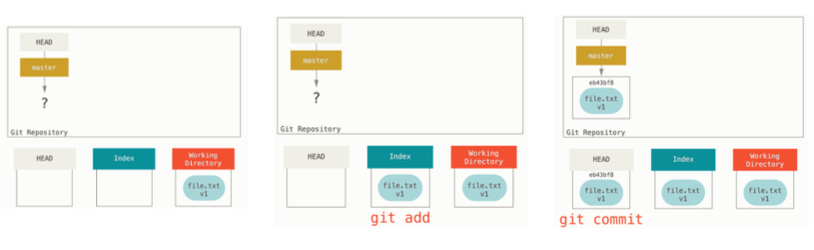
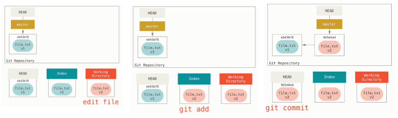
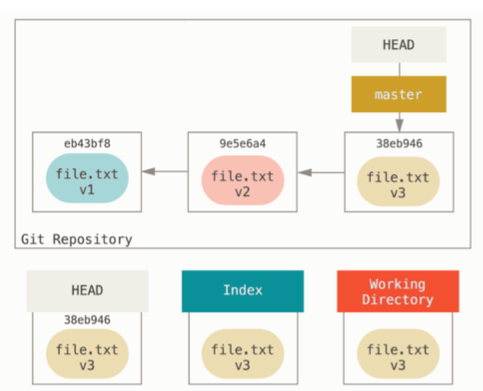

## Git 깃 이란
* git은 컴퓨터 파일의 변경 사항을 추적하고 여러 명의 사용자들 간에 해당 파일의 작업들을 조율하는 데에 사용되는 분산 버전 관리 시스템이다. 
* 주로 소프르웨어 개발 과정에서 소스코드 관리(버전관리, 협업 등)을 위해 주로 사용된다.

## Life cycle in working directory
* tracked
    * unmodified : 마지막 커밋 이후 변화 없음
    * modified : 마지막 커밋 이후 변화 존재
    * staged
* untracked

## basic command
* Commit
* Adding directory
* Git log
---
1. Commit 
    1. git status : staged(초록), unstaged(빨강)를 색으로 확인가능
    2. git add : changes를 staged로 올릴 수 있음
    
    * Head, Index(Staging Area),  Working directory
        * Head (repository) : 현재 branch가 가리키는 포인터, 가장 마지막 커밋
        * Index (staging area) : 바로 다음에 커밋할 것
        * Working Direcrory : 파일이 있는 장소

        
        
        

2. Adding directory
    * 깃은 오직 파일들에 대해서만 알고 디렉토리는 모른다. 따라서 새로운 디렉토리를 생성하고 git status를 보게되면 아무것도 뜨지 않는다. 이때 touch (filename) 으로 파일을 생성하여 git status에 걸리도록 할 수 있다.

3. git log
* 시간 역순으로 모든 커밋 내용을 확인할 수 있다. 옵션으로 -p를 사용하면 커밋들 간의 차이를 확인할 수 있다.