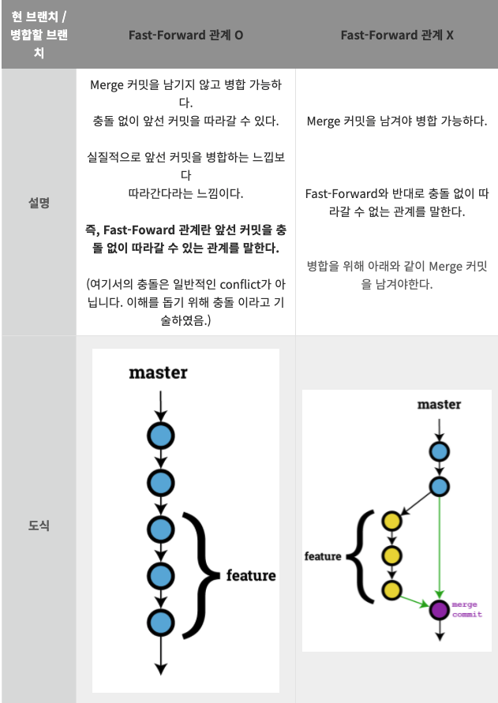

### Merging 병합

    - 다른 기능이나 버그 수정을 위해 다른 브랜치에서 작업한 것을 main 브랜치로 가져오기 위한 과정
    - ours : 원본 브랜치 / theirs : ours로 가져오기 원하는 브랜치
    - ours branch 에서 git merge <theirs> 로 병합가능

- Fast-forward merge
  
  (이미지 출처 : https://minemanemo.tistory.com/46)
  - 즉, fast-forward 관계는 두 개의 커밋이 존재할 때, 하나의 커밋 히스토리가 다른 커밋 히스토리에 전부 포함되는 경우를 말함
  - 이 경우 merge commit이 만들어지지 않고 브랜치의 참조만 변경됨
  - --ff 로 기본 설정임
  - --no-ff : ff 관계이더라도 merge commit을 만듬
  - --squash : 워크 트리와 인덱스의 상태는 병합 후의 상태가 되지만 merge commit은 만들어지지 않아 스스로 커밋해야함
- 각 merge 옵션들의 용도 구분 예시

  - --ff
    - 로그가 하나로 되어 토픽 브랜치가 있었다는 정보가 사라짐. 토픽 브랜치의 존재를 로그에 남길 필요가 없어 그대로 커밋해도 문제가 없는 경우
  - --no-ff
    - --ff와 달리 토픽 브랜치가 있었다는 정보가 남음. 기본적으로 --no-ff를 사용하는 것이 좋음
  - --sqush
    - 토픽 브랜치가 있었다는 정보다 코밋로그도 모두 남지 않음. 토픽 브랜치에서 행한 작업이 작아 １커밋으로 정리해버려도 문제가 없는 경우 사용

- http://amazingguni.github.io/blog/2016/03/git-branch-%EA%B7%9C%EC%B9%99
  - 읽어보기
