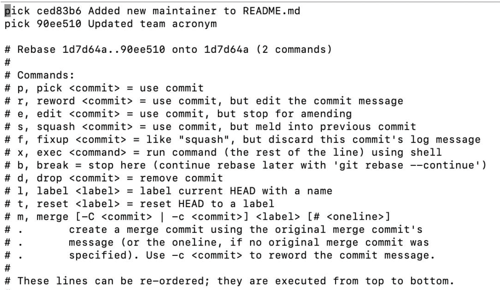

### Rebasing

    - git에서 한 브랜치에서 다른 브랜치로 합치는 방법은 두 가지
        - merge & rebase
    - merge : 내부적으로 두 커밋의 공통 조상을 이용해 3-way merge를 실행 + 새로운 커밋 메세지
    - rebase : 말그래돌 base를 다시 만든다고 보면 됨.
    공통 조상과 한 커밋의 차이를(diff) patch에 저장. patch를 base에 적용함으로써 커밋 히스토리를 한 줄로 정리 가능
    - 따라서 많은 작업 브랜치를 메인 브랜치로 merge를 하게 되면 그만큼의 머지했다는 메세지의 머지 커밋이 존재하게 되지만 rebase를 하면 보다 깔끔한 history를 유지할 수 있음
    - git이 단순히 커밋을 움직이는 것이 아니라 실제로 새로운 커밋을 만드는 것(patch 내용을 기반으로)

- merge vs rebase

  - merge : 큰 변화를 생성했을 때 (새로운 기능 추가 등) / 복잡한 히스토리가 영향을 주지 않을 때
  - rebase : 변화를 선형적으로 그룹짓고 싶을 때 / 지저분하게 local commit이 있을 때 / 팀이 히스토리 그래프를 자주 사용할 때

    - 참고 : https://velog.io/@kwonh/Git-Rebase%EB%9E%80

- interactive rebase
  - 과거 커밋에 오타가 있을 때
  - 테스트용 커밋이 딸려 들어갔을 때
  - 비슷한 커밋이 두 개로 분리되어 있어서 이것들을 합치고 싶을 때
  - 이때 --interactive 옵션을 사용할 수 있음 ( -i 옵션)
    - git rebase -i {수정할 커밋의 직전 커밋}
    - 이후 vi 에디터를 통해 사용할 수 있는 명령어들을 확인할 수 있음
    - 
