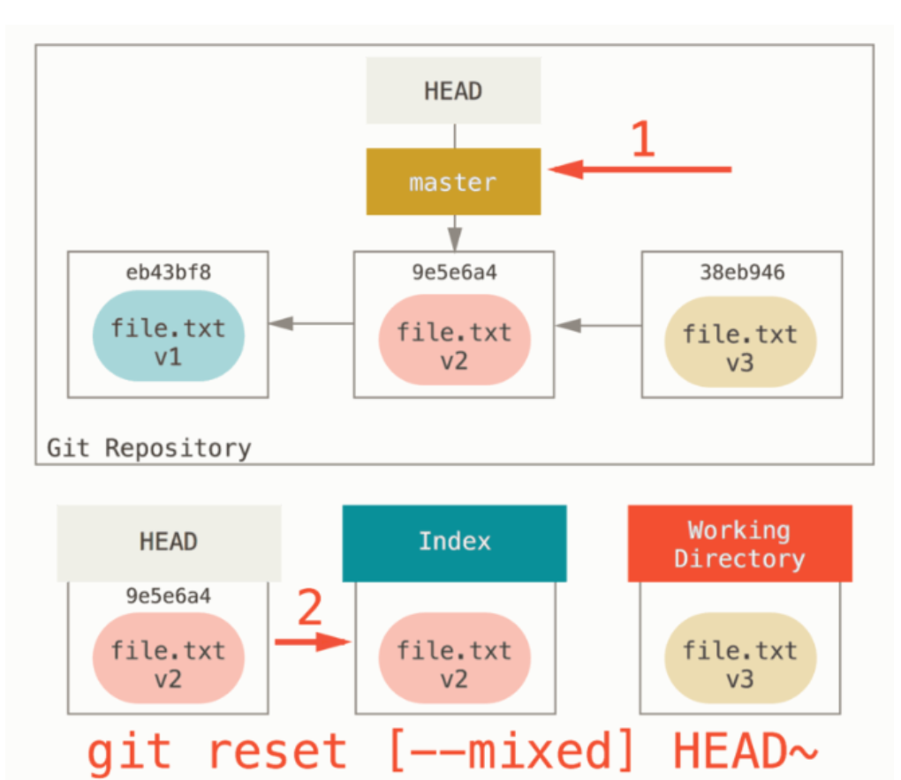

## Staging

- 왜 staging이 존재하는가

  - 커밋은 a logical collection of changes that make sense as a unit 이어야 함
  - working directory 에서 한 번에 repository로 커밋을 하는 것이 아닌 staging area 를 두어서 logical, structure 형태로 commit을 만들기 위해 필요함
  - git reset 을 이용하면 현재의 커밋에서 과거, 미래의 커밋으로 이동할 수 있음

- Undoing staged changes

  - git reset (--mixed) Head [filename] -> Head가 가리키는 파일을 index 파일로 복사함 <-> git add [filename]

    - 현재 작업중인 working directory는 영향 없음

    
    

  - git reset --soft Head [filename] -> Index 나 working directory 는 그대로 두고 Head만 이전 커밋으로 이동 (영향 없음)
    

  - git reset --hard Head [filename] -> Index와 working directory도 이전 커밋으로 모두 이동
    - working directory 내용을 커밋 하지 않고 git reset -hard 사용하면 내용이 날아가게 됨 (주의할 것)
      
