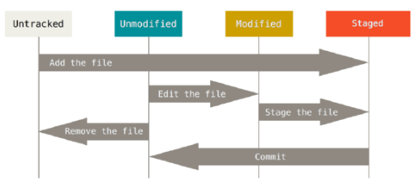
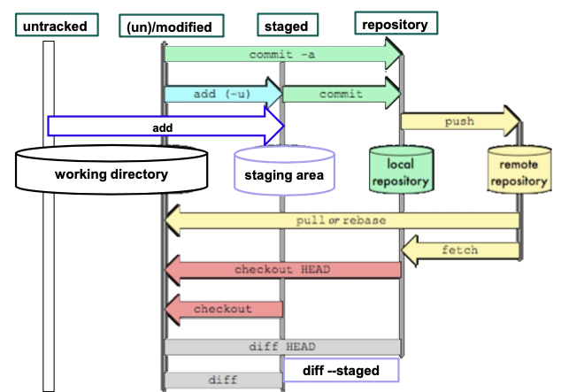

## Git 깃 이란
* git은 컴퓨터 파일의 변경 사항을 추적하고 여러 명의 사용자들 간에 해당 파일의 작업들을 조율하는 데에 사용되는 분산 버전 관리 시스템이다. 
* 주로 소프르웨어 개발 과정에서 소스코드 관리(버전관리, 협업 등)을 위해 주로 사용된다.

## Life cycle in working directory
* tracked
    * unmodified : 마지막 커밋 이후 변화 없음
    * modified : 마지막 커밋 이후 변화 존재
    * staged
* untracked

## basic command
* Commit
* Adding directory
* Git log
---
1. Commit 
    1. git status : staged(초록), unstaged(빨강)를 색으로 확인가능
    2. git add : changes를 staged로 올릴 수 있음
    
